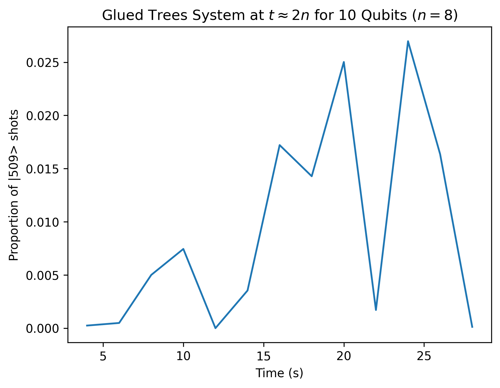
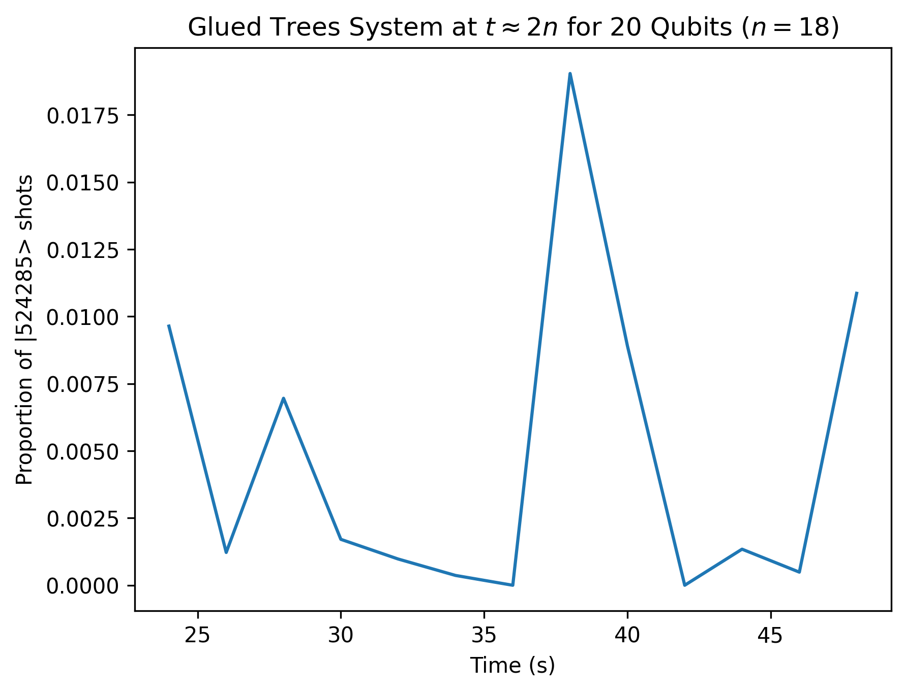

# Glued Trees
This repository contains the code for the latest version of a quantum circuit implementation for the glued trees algorithm. You can view the current iteration of the algorithm in the Jupyter notebook attached. **The algorithm is currently under active development and has not yet been thoroughly tested.** I plan to perform significant data analysis on actual quantum hardware over the coming weeks. I also hope to create a web resource in the near future that shows why this problem is inefficient to solve classically and why a quantum computer can solve it more efficiently.

I began working on this project as part of [QRISE 2024](https://github.com/adam-godel/qrise2024-classiq-challenge) for [Classiq](https://github.com/Classiq). I was selected as a winner of QRISE and the research exchange has since ended, but I am still working with Classiq to greatly improve the algorithm with the goal of running as large of an implementation as possible on real quantum hardware. If you would like to learn more about me, feel free to access my website at [adamgodel.me](https://adamgodel.me/). You can also send me an email at agodel@bu.edu.

This README file describes the glued trees problem and my approach in detail with a to-do list at the end describing my near-term goals for the project as they currently stand. 

**The [`website`](https://github.com/adam-godel/glued-trees/tree/main/website) directory will contain the code for a web resource introducing the project, but it is currently unfinished and under active development.**

## Describing the Problem
Consider a network of two mirrored binary trees connected to each other, where the outermost nodes of each tree are connected to two random nodes in the other tree. This structure will have $2n$ columns and $2^{n+1}-2$ nodes in total, as shown in the diagram below. Each node in the structure has a secret key in the form of a random bit string of size $2n$, and you can query a node using its key to get the keys of its neighbors. Your goal is, given the key of the entrance node, to find the key of the exit node as efficiently as possible.

<p align="center">

</p>

If you try to play this game yourself, or program an algorithm to do so, you'll quickly run into a major problem: since you don't know what specific nodes on the tree the interior keys correspond to, you will get lost within the structure once you reach the area between the two trees. There is no way to guarantee a solution to this problem—using a classical computer—that doesn't require you to check every node in the worst case.

## A Quantum Approach
There is a way to solve this problem efficiently however, on the order of the total number of *columns* of the structure instead of the nodes. You just need to use a quantum computer! This [paper](https://journals.aps.org/prx/pdf/10.1103/PhysRevX.13.041041) published in December 2023 describes a quantum approach to solving this algorithm by considering the columns of the structure as a system of coupled harmonic oscillators attached by springs. A quantum computer can use Hamiltonian simulation to simulate this classical system efficiently. If you apply a push to the oscillator representing the entrance node, and treat the interactions between nodes as queries, you can "reach" the exit node (trigger a spike in its oscillatory movement) in time $2n$, offering linear efficiency as opposed to exponential efficiency!

I will now describe the technical aspects of this approach in further detail. To model the columns of the glued trees structure as a system of coupled harmonic oscillators, we consider a matrix $\mathbf{A}$ of size $N \times N$ corresponding to the nodes of the glued trees structure, such that $N=2^{n+1}-2$ and $n$ is the number of columns of one of the two glued trees. This matrix is defined as $\mathbf{A}=3(\mathbf{1}_N)-A$, where $A$ is the adjacency matrix of the glued trees system using any ordering.

As an example, using a simple linear ordering of this adjacency matrix such that the entrance node is first and the exit node is last, this matrix will be defined as the following:
```math
\mathbf{A} = \begin{pmatrix}
3 & -1 & -1 & 0 & \cdots & \cdots & \cdots & \cdots & 0 \\
-1 & 3 & 0 & -1 & \cdots & \cdots & \cdots & \cdots & 0 \\
-1 & 0 & 3 & 0 & \cdots & \cdots & \cdots & \cdots & 0 \\
0 & -1 & 0 & 3 & \cdots & \cdots & \cdots & \cdots & 0 \\
\vdots & \vdots & \vdots & \vdots & \ddots & \vdots & \vdots & \vdots & \vdots \\
\vdots & \vdots & \vdots & \vdots & \vdots & 3 & 0 & -1 & 0 \\
\vdots & \vdots & \vdots & \vdots & \vdots & 0 & 3 & 0 & -1 \\
\vdots & \vdots & \vdots & \vdots & \vdots & -1 & 0 & 3 & -1 \\
0 & 0 & 0 & 0 & \cdots & 0 & -1 & -1 & 3
\end{pmatrix}
```

As shown in further detail in the paper, we can define a block Hamiltonian $\mathbf{H}$ such that
```math
\mathbf{H} := -\begin{pmatrix}
\mathbf{0} & \mathbf{B} \\
\mathbf{B}^† & \mathbf{0}
\end{pmatrix}
```
where $\mathbf{B}$ is any $N \times M$ matrix such that $\mathbf{B}\mathbf{B}^†=\mathbf{A}$. However, to use this matrix $\mathbf{H}$ for Hamiltonian simulation, it must have a size corresponding to a power of two, while $\mathbf{A}$ is size $N \times N$. We can deal with this by ensuring that $\mathbf{B}$ is size $N \times (N+4)$, so the resulting Hamiltonian $\mathbf{H}$ is a square matrix with side length $2N+4 = 2(2^{n+1}-2)+4 = 2^{n+2}$. This means that a glued trees system with $n$ columns for one tree can be simulated using $n+2$ qubits.

## Creating a Quantum Circuit
I am working with [Classiq](https://github.com/Classiq) to create a quantum circuit implementation of the glued trees problem using their Python software development kit. One of the biggest advantages of using Classiq for this task is that their functions can be applied to an arbitrary number of qubits—in other words, you can create a Python function that takes in the size of the glued trees system as a parameter without needing to fundamentally change the code to model systems of different sizes. 

To achieve this task, I am simply using the [`exponentiation_with_depth_constraint`](https://docs.classiq.io/latest/explore/functions/qmod_library_reference/qmod_core_library/hamiltonian_evolution/exponentiation/exponentiation/) function in Classiq, which takes in the matrix $\mathbf{H}$ in the form of a Pauli list, a linear combination of tensor products of Pauli operators $X$, $Y$, $Z$, and $I$. We can generate the matrix $\mathbf{A}$ by building the glued trees structure using the NetworkX library such that the nodes are labeled in order from the entrance to exit node and using the [`nx.adjacency_matrix`](https://networkx.org/documentation/stable/reference/generated/networkx.linalg.graphmatrix.adjacency_matrix.html) function to generate an adjacency matrix using that ordering. We can then decompose $\mathbf{A}$ using [Cholesky decomposition](https://en.wikipedia.org/wiki/Cholesky_decomposition) to get a square matrix where its product with its conjugate transpose is equal to $\mathbf{A}$. This matrix is the same size as $\mathbf{A}$, however, so we must pad it with 4 columns of zeroes to get our matrix $\mathbf{B}$ of size $N \times (N+4)$ so $\mathbf{H}$ has a size corresponding to a power of two. We can then create the block Hamiltonian with the proper size using $\mathbf{B}$ and $\mathbf{B}^†$, and generate its full Pauli list using Qiskit's [`SparsePauliOp.from_operator`](https://docs.quantum.ibm.com/api/qiskit/qiskit.quantum_info.SparsePauliOp) function.

The major challenge of this approach is efficiently creating and compressing the Pauli list into a state where it both accurately represents the original Hamiltonian and can be converted into a circuit with a reasonable circuit depth given the limits of today's quantum hardware (currently in the low thousands) for large qubit values.

## Compressing Pauli Lists
The size of the Pauli list entered into the exponentiation function is the biggest factor in the resulting circuit depth. After some experimentation, I found that Pauli lists of roughly size 200 result in a circuit depth in the 1200s, around the range of the limit for current state of the art quantum hardware. To compress Pauli lists of any qubit size, I created two algorithms: one to crop full Pauli lists for qubit sizes where the Pauli list can be generated in reasonable time, and one to approximate Pauli lists for larger qubit sizes from cropped Pauli lists of smaller qubit sizes. The Pauli lists for 1-13 qubits are generated with the first algorithm, while higher qubit sizes are generated with the second algorithm. 13 qubits is the highest qubit size with a Pauli list that can be authentically generated in a reasonable time, as Pauli decomposition is an incredibly time expensive operation, to the order of $\mathcal{O}(4^n)$.

The first algorithm can be found in the `generate_pauli_list` function contained in the [`glued_trees.ipynb`](https://github.com/adam-godel/glued-trees/blob/main/glued_trees.ipynb) notebook. It uses an ad hoc approach that tries to represent the Pauli list as a whole as accurately as possible using only the 200 ostensibly most relevant terms to simulating the system. The algorithm first selects 120 terms (60%) by going through each character position from the end to the start and picking the Pauli terms with the largest coefficients that contain each of the four possibilities ($I$, $X$, $Y$, $Z$) at that character position. If all positions are exhausted before reaching 120 terms, the algorithm takes another pass through the character positions until 120 are selected. The other 80 terms (40%) are selected by picking the 80 remaining terms with the largest coefficients. Through my experimentation, I found that this algorithm does a pretty good job of accurately representing the full Pauli list results when comparing them in a simulator. The algorithm balances important high-coefficient terms with diversity in the 200 selected terms.

The second algorithm is used for approximating Pauli lists too large to generate. It simply takes the current largest Pauli list generatable in reasonable time and pads it with its second character until the desired qubit size is reached. This approximation method is generally effective since most significant Pauli strings for the matrix contain a long substring of the same character beginning with the second character. Adding that same character and keeping the coefficient generally follows the trend present when comparing generated Pauli strings for different qubit sizes to each other.

## Results
Once we have assembled our block Hamiltonian $\mathbf{H}$, we can perform Hamiltonian simulation $e^{-it\mathbf{H}}$ using Classiq's [`exponentiation_with_depth_constraint`](https://docs.classiq.io/latest/explore/functions/qmod_library_reference/qmod_core_library/hamiltonian_evolution/exponentiation/exponentiation/) function. The resulting quantum state can be written as follows:
```math
\begin{aligned}
|\psi(t)\rangle &\propto \begin{pmatrix}
\dot{\vec{x}}(t) \\
i\mathbf{B}^†\vec{x}(t) 
\end{pmatrix} \\
\begin{pmatrix}
\dot{\vec{x}}(t) \\
i\mathbf{B}^†\vec{x}(t) 
\end{pmatrix} &= e^{-it\mathbf{H}} \begin{pmatrix}
\dot{\vec{x}}(0) \\
i\mathbf{B}^†\vec{x}(0) 
\end{pmatrix}
\end{aligned}
```
where $\vec{x}(0)=(0,0,\dots,0)^T$ and $\dot{\vec{x}}(0)=(1,0,\dots,0)^T$ using a linear ordering of nodes. 

Since the speed of the entrance node oscillator $|\dot{x}_1(t)|$ is represented by the quantum state $|0\rangle$ and should have probability 1 at $t=0$, there is no specific state preparation necessary for this system. It should also be noted that since our matrix $\mathbf{B}^†$ is padded with 4 rows of zeroes, the highest 4 quantum states do not correspond to the displacement or speed of any oscillator. This means that the quantum state representing the speed of the exit node oscillator $|\dot{x}_N(t)|$, which is what we are most interested in, will correspond to $|N-1\rangle=|2^{n+1}-3\rangle$. We will be tracking this particular quantum state at time $t \approx 2n$ expecting a spike, which represents the system of oscillators "reaching" the exit node from the initial push to the entrance node.

The following graphs show the proportion of shots on the Classiq Aer simulator for the quantum state $|N-1\rangle$ representing the speed of the exit node oscillator $|\dot{x}_N(t)|$ for 10 qubits ($n=8, N=510$) and 20 qubits ($n=18, N=524286$) respectively. As a reminder, the expected behavior is a spike for most of these values around $t \approx 2n$, and you can clearly see a large spike on both of the graphs.

<p align="center">


</p>

I am planning to run the algorithm for larger qubit sizes on quantum hardware and present those results in the next several weeks.

All of the graphs I executed can be found in the [`figures`](https://github.com/adam-godel/glued-trees/tree/main/figures) folder, and the JSON files of the execution jobs from Classiq can be found in the [`results`](https://github.com/adam-godel/glued-trees/tree/main/results) folder.

## Future Goals
This project is currently under active development. I will be consistently working on this project over the coming weeks to optimize the algorithm with the hope of ultimately running it on state of the art quantum hardware for qubit sizes too large to run on a simulator. You can view the current to-do list regarding the project below.
### To-Do
- [X] Create an initial working version of the algorithm
- [X] Write the repository description in detail
- [X] Rewrite Pauli decomposition function to be more efficient
- [X] Write script to approximate larger cropped Pauli lists from smaller Pauli lists
- [X] Run and graph results for the higher range of simulatable circuits (greater than 10 qubits)
- [ ] Run and compare quantum hardware results with simulatable results at this range
- [ ] Run the algorithm on quantum hardware at qubit sizes too large to simulate
- [ ] Create an interactive web resource showing why this problem has a quantum advantage
